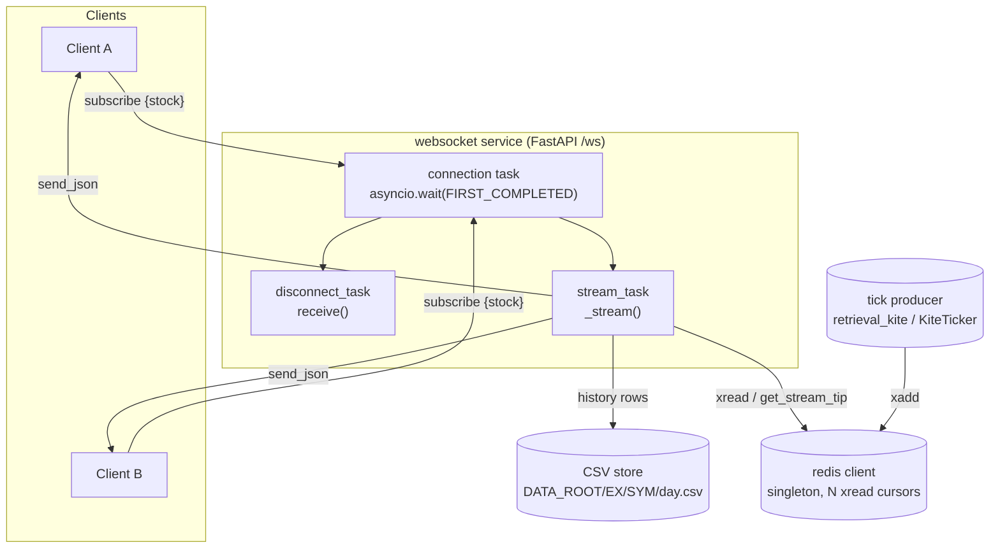

# Architecture

```mermaid
flowchart TB
    subgraph Clients
        C1[Client A]
        C2[Client B]
    end

    subgraph "websocket service (FastAPI /ws)"
        WS["connection task<br/>asyncio.wait(FIRST_COMPLETED)"]
        DISC["disconnect_task<br/>receive()"]
        STREAM["stream_task<br/>_stream()"]
        WS --> DISC
        WS --> STREAM
    end

    CSV[("CSV store<br/>DATA_ROOT/EX/SYM/day.csv")]
    REDIS[("redis client<br/>singleton, N xread cursors")]
    PRODUCER[("tick producer<br/>retrieval_kite / KiteTicker")]

    C1 -- "subscribe {stock}" --> WS
    C2 -- "subscribe {stock}" --> WS

    STREAM -- "history rows" --> CSV
    STREAM -- "xread / get_stream_tip" --> REDIS
    PRODUCER -- "xadd" --> REDIS

    STREAM -- "send_json" --> C1
    STREAM -- "send_json" --> C2
```

Each connection gets its own task pair: `disconnect_task` races `stream_task`, loser
cancelled. CSV reads and Redis tails are independent per connection — safe to fan out.
